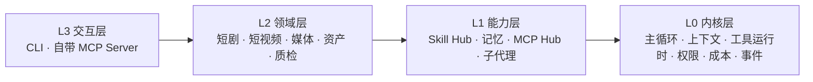

# AIGC 内容创作 Agent

> 从零手搓的 AIGC 内容生产 Agent。在终端里跟它对话，就能把一句创意做成**短剧成片**、**抖音短视频**、**广告片**和**海报**。
> 要花钱的、不可逆的、需要拍板的事，它都会先停下来问你。


它由两部分组成：一个**自己写的 Agent 运行时**（harness：主循环、上下文管理、工具运行时、权限闸门、成本护栏、事件流，没有用 LangChain 之类的框架），加上**长在它上面的内容生产领域层**（短剧、短视频、广告、海报的 40 多个工具）。内核不认识「短剧」「抖音」，领域能力全部以工具（function）、方法论文档（skill）和可选流程图（graph）的形式挂上去。

---

## 能做什么

| 产线 | 你给它 | 它产出 |
|---|---|---|
| **短剧** | 一句创意，或你自己的剧本 | 创作方案 → 逐集剧本 → 分镜 → 资产库（角色 / 按场景的服装 / 场景 / 道具 / 音色）→ 参考图 → Seedance 视频提示词 → 并发渲染 → 每集成片 `第01集.mp4` |
| **抖音短视频** | 一个关键词 + 选一种风格 | 抓真实热点 → 归纳成新内容（事实标出处）→ 分镜 → 素材（向你要 / 找可商用素材 / AI 生成）→ 配音、字幕、快切成片 |
| **广告** | 产品图 + 卖点 | 以产品图为身份锁的投放级短片，文字后期本地叠加 |
| **设计** | 主题 + 文案 | 生图底图 + 本地排版叠字的海报 |
| **爆款拆解** | 一条抖音链接 | 公开数据、评论、抽帧、逐字稿 → 归因报告 |

配套能力：长期记忆、方法论 skill 热加载、合规机审（只列风险不改字）、待发布包（不自动发布）、数据回流复盘、会话回放与成本看板。

## 设计上的几个特点

- **人审是工具，不是流程节点**：模型自己判断什么时候调用 `request_review`，主循环真的挂起；你输入 `a` 采纳 / `r` 打回 / `j` 退回后，它带着你的意见接着干。
- **一切产出皆资产**：文本、分镜、图、音频、视频都带版本和血缘。可以 `/rollback` 到任意一版重来；重渲只补失败的段，已经成功的段直接复用。
- **成本是一等公民**：开工先确认额度，渲染前整批报价（含质检重试的最坏情况），项目级、日级预算跨会话累计；中途停掉的任务再次请求时从台账取回，不重复付费。
- **质检门不假装成功**：真实感、人物一致性、画面无字幕、单镜 ≤3 秒、引用完整性……生成后自动校验、不合格自动重来；仍不达标或者「没查成」，都会如实标出来，由你决定放行还是重渲。
- **上下文工程**：滑窗 + 轮内压缩 + 能力预算；60 集长剧的逐集写作交给无状态子代理，主循环只收资产 id，不会把上下文撑爆。
- **安全边界**：文件访问白名单、凭据文件硬拒绝、改 Agent 自身文件要确认、外部工具返回的内容标注来源、换生成模型必须经你同意。
- **分层架构**：L0 内核 / L1 能力 / L2 领域 / L3 交互，依赖严格单向向下，由 import-linter 强制检查。



---

## 快速开始

### 1. 准备

- **Python 3.11+**
- **ffmpeg**（成片、抽帧、质检都要用；Windows 可以 `winget install Gyan.FFmpeg`）
- **API key**（按要用的功能准备，详见 [使用指南 · 配置](docs/使用指南.md#3-配置)）：

| 想做什么 | 最少需要 |
|---|---|
| 只聊天、写文案 | `KIMI_API_KEY`（Kimi Code） |
| 短剧出片 | `KIMI_API_KEY` + `APIMART_API_KEY`，建议再配一个图床（`SEE_API_TOKEN`），本地照片才能当参考图 |
| 抖音短视频 | `KIMI_API_KEY` + `APIMART_API_KEY` + `MINIMAX_API_KEY`（配音）；`TIKHUB_API_KEY`（热榜）可选 |

- 国内网络访问部分接口需要代理（在 `.env` 里配 `HTTPS_PROXY`）。

### 2. 安装

```bash
git clone https://github.com/yihuandeps/aigc-agent.git
cd aigc-agent

# Windows
py -3.11 -m venv .venv
.venv\Scripts\python -m pip install -e ".[p1]" -c requirements-lock.txt

# macOS / Linux
python3.11 -m venv .venv
.venv/bin/python -m pip install -e ".[p1]" -c requirements-lock.txt
```

`requirements-lock.txt` 是作者实测可用的版本组合，作为约束文件使用。要用浏览器采集再加 `rpa` 组，要导出爆款拆解 PDF 再加 `douyin` 组（例如 `".[p1,rpa,douyin]"`）。Windows 上建议放在**纯英文路径**下（中文路径会让 editable 安装失效，见 [使用指南 · 安装](docs/使用指南.md#2-安装)）。

### 3. 填密钥

```bash
.venv\Scripts\agent setup --write     # 从 .env.example 生成 .env（macOS / Linux 用 .venv/bin/agent）
```

然后编辑 `.env`，填入你的 key。**`.env` 已在 `.gitignore` 里，永远不要把真实 key 写进其它文件或提交到仓库。**

### 4. 自检

```bash
agent setup      # 离线检查：.env、代理、ffmpeg、必需的 key
agent doctor     # 联网检查：配置解析、各 provider 连通性、模型 id 是否可用
```

> 下文的 `agent` 指 `.venv` 里的命令：先激活虚拟环境（Windows 运行 `.venv\Scripts\activate`），或者在 Windows 上把仓库目录加进 PATH，直接用仓库根目录的 `agent.cmd`。

### 5. 开始

**一个文件夹 = 一个项目。** 给每部作品建一个文件夹，在那里启动：

```bash
mkdir E:\我的短剧\外卖逆袭
cd E:\我的短剧\外卖逆袭
agent chat
```

启动时选产线（短剧 / 抖音短视频 / 广告 / 设计）、确认开工额度，然后直接说你要做什么：

```
你> 想做一部都市逆袭短剧：外卖员被豪门认亲，女频爽燃，20 集左右
```

---

## 用起来是什么样

```
你> /auto on                                     ← 小节点自动采纳，大节点仍然问你；同时开启按集流水
你> 大团圆，20 集，每集 4 分钟，中文面孔，中文台词

人审 · 剧本   [创作方案全文…]
> a 第1集开场就是认亲现场的冲突                    ← 采纳，并附上补充要求

需要确认  drama_render_assets：参考图要新生成 46 张，质检最坏情况……额度还剩……
执行吗？(y/N) y

⏸ 参考图渲完了：先看一眼脸和服装（产物目录 images/）；要给角色定音色，在对话里说「定音」。
  都满意了输入 /auto go，开始渲第 1 集
你> 定音
你> /auto go
⏸ 第 1 集渲完了：先看一下成片……满意了输入 /auto go，其余各集自动并行渲
你> /auto go
```

产物都落在你的项目文件夹里：

```
外卖逆袭/
  texts/       剧本、方案等文本的可读镜像
  images/      参考图-角色-01_陆离.png …
  videos/      第01集-03_2场_镜9-18.mp4 …（被质检换掉的版本在 videos/废弃/）
  exports/     第01集.mp4 …
  音色锚点/     <角色>.mp4
```

## 常用命令速查

**聊天里**（敲 `/` 有补全菜单）：

| 命令 | 作用 |
|---|---|
| `a` / `r 理由` / `j 理由` / `o` | 人审：采纳 / 打回重写 / 方向不对退回 / 打开候选文件 |
| `/type` | 切换产线：短剧、抖音短视频、广告、设计 |
| `/auto on` · `off` · `stop` · `go` · `retry` | 自动人审 + 按集流水；`go` 放行停点，`stop` 当场硬停 |
| `/budget` · `/budget set …` · `/budget allow 50` | 查看 / 调整额度 / 临时追加 |
| `/length 8` · `/length auto` | 一集几分钟 / 跟剧本走 |
| `/ratio 16:9` · `/cut 拦` | 视频画幅 / 镜头超 3 秒是否拦下 |
| `/out <路径>` | 换到另一个项目文件夹 |
| `/stop` · `/now <消息>` · `/retry` | 停掉当前一轮 / 插队 / 同一轮续跑 |
| `/stat` · `/trace` · `/rollback <资产id>` | 状态 / 执行痕迹 / 回退到某一版重来 |
| `/remember …` · `/forget …` · `/brief` | 记住一条规则 / 作废记忆 / 记忆简报 |

**命令行**：

| 命令 | 作用 |
|---|---|
| `agent chat` | 交互式对话（主入口） |
| `agent video make "主题" -r ugc-vlog` | 一条命令按配方出短视频 |
| `agent drama run --file 剧本.txt` | 不进聊天，手动跑短剧拆解链 |
| `agent assets rename` | 把产物改成可读的序号文件名并写清单 |
| `agent sessions cost <会话>` | 某次会话的成本看板 |
| `agent memory list` · `agent skill list` | 记忆 / skill 管理 |

完整说明见 **[使用指南](docs/使用指南.md)**。

---

## 文档

| 文档 | 内容 |
|---|---|
| [docs/使用指南.md](docs/使用指南.md) | **安装、配置、全部命令、四条产线的完整教程、已知问题、常见问题** |
| [ARCHITECTURE.md](ARCHITECTURE.md) | 架构与模块划分（L0–L3，22 个模块） |
| [docs/架构流程图.md](docs/架构流程图.md) | 十张流程图：启动装配、主循环、上下文、权限闸门、短剧链、质检门…… |
| [TECH_STACK.md](TECH_STACK.md) | 技术栈决策 |
| [skills/README.md](skills/README.md) | 怎么写一个 skill（方法论文档） |
| [docs/开发记录.md](docs/开发记录.md) | P0–P5 各阶段验收标准、运行优化记录 |
| `docs/审查-*.md` · `docs/复审-*.md` · `docs/待拍板-*.md` · `docs/优化-*.md` | 历次全链路审查与修复记录 |

## 项目结构

```
config/            模型、媒体模型、预算、托管、文件边界、机审规则、平台规格、MCP
  recipes/         短视频风格配方（改 yaml 就能调效果）
skills/            方法论 markdown（存盘即生效）
src/aigc_agent/
  harness/         L0 内核：主循环、模型网关、上下文、工具运行时、权限、事件
  capabilities/    L1 能力：Skill Hub、记忆、MCP Hub、子代理、检索
  domain/          L2 领域：内容工具、资产、短剧、流水线、媒体、机审、分发、数据回流
  interfaces/      L3 入口：agent 命令行、自带的 MCP Server
tests/             1486 个测试（含真 ffmpeg、真 MCP stdio）
scripts/           辅助脚本（如从上游生成 seedance skill）
```

## 开发与测试

```bash
pip install -e ".[p1,dev]" -c requirements-lock.txt
python -m pytest tests/ -q          # 全量测试
python -m ruff check src/ tests/    # 代码风格
lint-imports                        # 分层依赖检查（不要用 python -m importlinter.cli，那个入口什么都不查）
```

## 注意事项

- **费用**：生图、生视频按次计费，长剧动辄几百段视频。开工额度、整批报价、预算上限都是为此设计的，请认真看报价再按 `y`。媒体模型在 `config/media_models.yaml` 里填了单价，金额护栏才能统计到视频花费。
- **密钥安全**：只把 key 写在 `.env`。Agent 自己的文件工具对 `.env`、`*.pem`、`*.key`、浏览器数据等硬性拒绝访问。
- **内容合规**：生成内容请按平台规则做 AIGC 标识（待发布包会自动写入）；浏览器采集和第三方数据接口请遵守对应平台的服务条款；别人的视频只能用于分析，不能进成片。
- **已知问题**：见 [使用指南 · 已知问题](docs/使用指南.md#11-已知问题)。
- 目前只在 Windows 11 + Python 3.11 上实测过；macOS / Linux 理论上可以运行，欢迎反馈。

## 致谢

- [0xsline/short-drama](https://github.com/0xsline/short-drama)（MIT）：短剧剧本创作方法论，用在 `skills/drama-script/`
- [LearnPrompt/awesome-seedance](https://github.com/LearnPrompt/awesome-seedance)（代码 MIT / 策划内容 CC BY 4.0）：Seedance 提示词模板与案例，用在 `skills/seedance-prompting/`
- [procmeans/rainwell-douyin-viral-analyzer](https://github.com/procmeans/rainwell-douyin-viral-analyzer)：抖音爆款拆解的抓取脚本与方法论（上游未声明许可证，版权归原作者）
- [yaohaoliang141-max/ai-character-passport](https://github.com/yaohaoliang141-max/ai-character-passport)：角色护照的思路

各第三方内容的许可与使用位置见 [THIRD_PARTY_NOTICES.md](THIRD_PARTY_NOTICES.md)。

## 许可证

本仓库自己的代码与文档采用 [MIT](LICENSE) 许可证；第三方内容按各自的许可（见上）。
