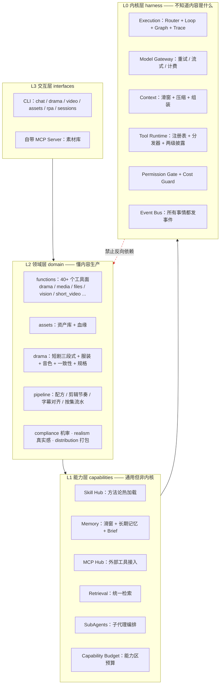
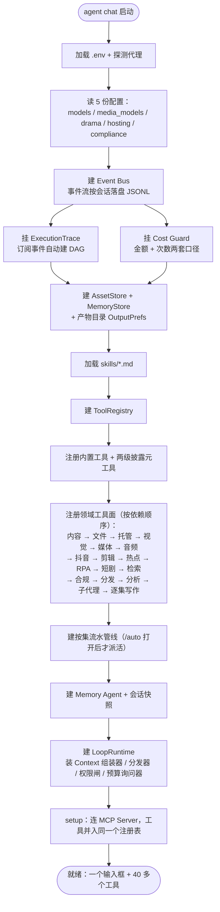
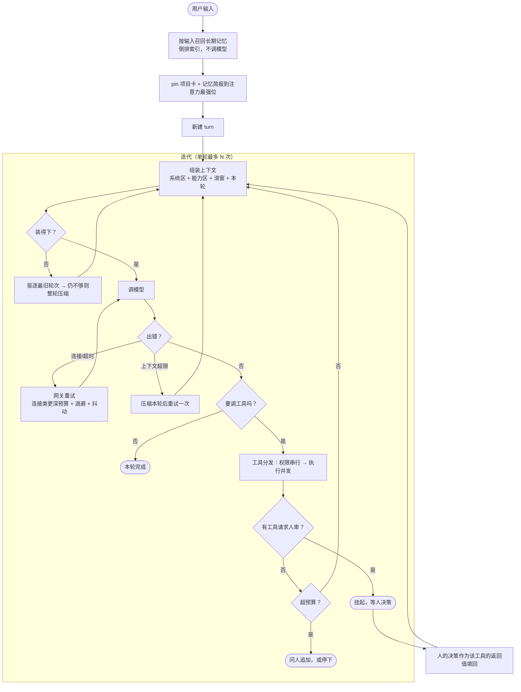
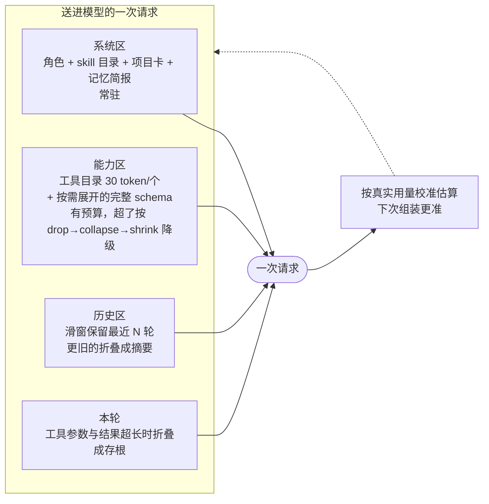
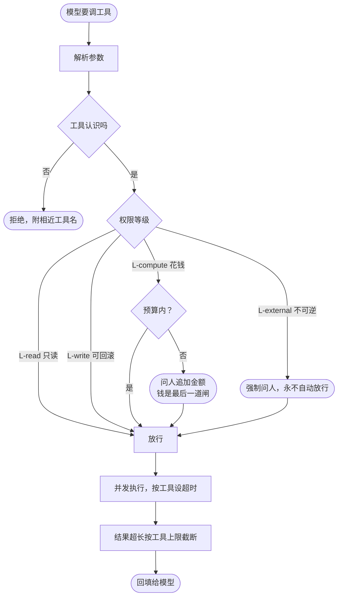
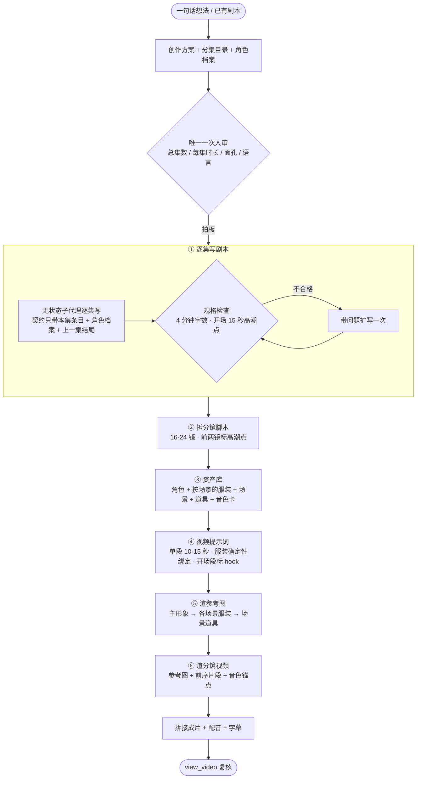
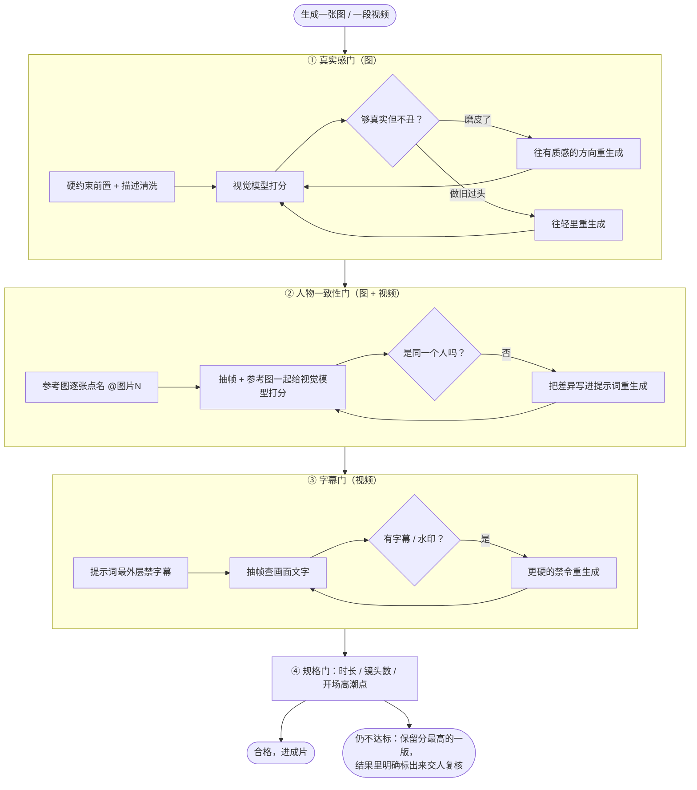
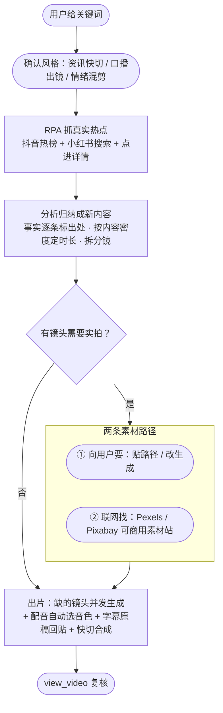
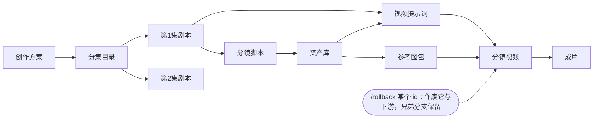
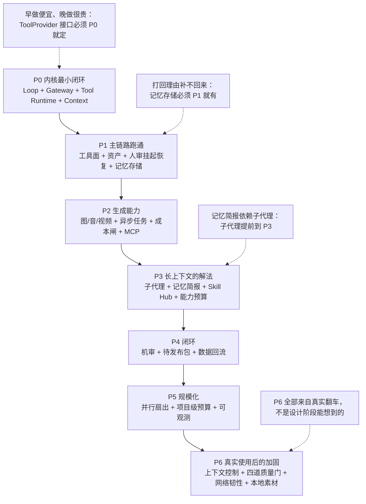

# AIGC 内容创作 Agent —— 架构与搭建逻辑（流程图版）

> 配套代码：`E:\手搓Agent`。文字版详解见仓库根目录 `ARCHITECTURE.md`，
> 运行时踩坑与修复记录见 `README.md`。本文只讲**怎么搭的**和**为什么这么搭**。

---

## 一句话概括

这是一个**自己写的 Agent 运行时（harness）+ 长在它上面的内容生产领域层**。
内核不知道"短剧""分镜"是什么，领域层不碰上下文、权限、成本这些事。
两边通过一个 `ToolProvider` 接口相连，所以换赛道只换领域层，内核不动。

---

## 图 1 · 分层与依赖

四层，**依赖严格单向向下**。这条由 import-linter 在 CI 里强制，违反就构建失败。

**为什么这么分**：换一个内容赛道（短剧 → 播客），只改 L2；
换一个模型供应商，只改 L0 的 Gateway。两边互不知情。

---

## 图 2 · 启动时装配什么（`app.py` 的 `create()`）

一次装配，顺序有依赖，不能乱。

**关键判断**：所有工具都注册进**同一个**注册表，MCP 的外部工具也不例外。
权限、成本、事件因此只有一套通路，不会分叉。

---

## 图 3 · 一轮对话怎么跑（主循环）

这是整个 Agent 的心脏。模型决定下一步，不是流程图决定。

**两个设计点**

- 人审不是流程图上的固定节点，而是**模型自己判断该让人看一眼时调用的一个工具**。
  它会挂起主循环；人的决策作为那次调用的返回值填回去，模型据此接着干。
- 单轮迭代上限是**护栏不是终点**。撞线后可以在同一轮里接着跑，不新开轮次，
  所以"人审前后仍算同一问一答"。

---

## 图 4 · 上下文怎么进模型

上下文是最稀缺的资源。四个区，各有各的淘汰规则。

**为什么要做这一层**：一部 60 集短剧，如果每集正文都进上下文，
窗口会从 3 万涨到 25 万 token 直接撞模型上限。
解法是**写作交给无状态子代理**，主循环只收资产 id 和结尾钩子。

---

## 图 5 · 一次工具调用要过几道闸

**权限串行、执行并发**：问人必须一个一个问，不然终端提示会交错；
真正执行可以几十个并发跑。

---

## 图 6 · 短剧生产链（主力场景）

六步固定，每步产出一个资产，下一步吃上一步的 id。

**并发与依赖**：无前置依赖的镜头全部并发；引用前序片段的、等音色锚点的按依赖排队。
失败的段重跑时**复用已成功的**，不整集重来。

---

## 图 7 · 四道质量门（都是"生成后校验 + 不合格自动重来"）

这是这套系统里最花力气的部分。每一道都对应一次真实翻车。

**共同的设计**：校验失败**不拦生成链路**，只记备注；
都不合格时保留最好的一版并如实报告，不假装成功。

---

## 图 8 · 抖音短视频分支（另一条主线）

---

## 图 9 · 资产、血缘与回退

所有产出都是 Asset，带父子关系。这让"回退到某一版重来"成为可能。

**执行痕迹**自动从事件流重建成 DAG，`/trace` 看文字版，`/mermaid` 出流程图。

---

## 图 10 · 搭建顺序的逻辑（为什么是这个顺序）

**P6 这一批的由来**（每条都对应一次实际失败）：

| 现象 | 根因 | 处理 |
|---|---|---|
| 生成的脸全是磨皮脸 | 真实感要求挂在提示词末尾被当成可选氛围 | 硬约束前置 + 描述清洗 + 生成后校验 |
| 人物换脸、服装乱变 | 参考图只是"传了"没点名；链接 24 小时失效后等于零参考 | 逐张点名 + 一致性打分重生成 + 链接刷新 |
| 同一角色声音越听越不像 | 每段视频各自发声 | 音色卡 + 音色锚点片段跨集沿用 |
| 画面被烧上字幕 | 模型把台词渲成字幕条 | 最高优先级禁令 + 抽帧检查重生成 |
| 一集 4 段挂 3 段 | 拼接后把远端链接换成本地路径；一次网络错误就判死任务 | 不改 uri + 深度重试 + 只补失败的段 |
| 代理抖一下整轮白做 | 重试只等 1.5 秒；失败即整轮判死 | 连接类深重试 + 同一轮自动续跑 + `/retry` |

---

## 最后：这套东西的取舍

| 决定 | 代价 | 换来的 |
|---|---|---|
| 自己写 harness 不用现成框架 | 前期慢 | 上下文、成本、权限、痕迹全部可控可改 |
| 流程是数据不是代码（yaml 配方/规格/风格） | 多一层解析 | 调效果不用改 Python，改完重启即生效 |
| 所有产出落资产带血缘 | 存储与代码开销 | 能回退、能对比、能复盘、能归因成本 |
| 质量门都做成"校验 + 自动重来" | 每次多一到两次模型调用 | 不合格的东西不会静默流到成片 |
| 人审只留关键的一次 | 需要提前把话问清楚 | 长剧批量生产不被逐条确认卡住 |

---

*文档随代码更新。最后修订：2026-09-19*
